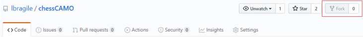

## Contributing :cupid:

Thank you so much for wanting to contribute to *chessCAMO*. Any constructive criticism regarding this project is welcomed and appreciated, as ultimately I love learning new things and getting better! It would be amazing if this project inspires or assists other users with their project ideas.

When contributing to this repository, please first discuss the change you wish to make via issue, email, or any other method with the owner(s) of this repository before making a change. 

There is a <a href="https://github.com/lbragile/chessCAMO/blob/master/CODE_OF_CONDUCT.md" target="__blank" style="text-decoration: none;">code of conduct</a>, please follow it in all your interactions with the project.

### Process :star2:

#### Step 1

- ##### Option 1

  - :fork_and_knife: Fork this repository :fork_and_knife:

    

- ##### Option 2

  - Clone this repository to your local machine using:

    `git clone https://github.com/lbragile/chessCAMO.git`

#### Step 2

- Make your changes and/or additions. :wrench::hammer:

- Ensure all test cases pass (must have <b>100%</b> pass rate to be approved): :heavy_check_mark:

  

- Increase the version numbers in all files to the new version that this Pull Request would represent. 

#### Step 3

- Create a new <a href=" https://github.com/lbragile/chessCAMO/pulls" target="__blank" style="text-decoration: none;">pull request</a>. :sunglasses:
- Include a relevant message discussing your contribution.
- Wait for the maintainer to review your pull request and merge it into the master branch :pray:.
- Celebrate your new open source contribution :trophy::clap::boom::exclamation:

## What to Contribute? :blush:

As this project is open-source, you can pick an choose what it is that you would like to contribute. This includes anything from improving the code (new function implementation, edits, comments, etc.), to adding test cases and/or any other files that you deem necessary for the successful completion of this project.

### Making Test Cases :100:

Take a look at the implementation file "*test.cpp*". This implementation file is meant to be used as a test case checker to improve efficiency in debugging and will indicate how to produce an appropriate test case.

The main process is as follows:

1. One can set-up a position in common chess sites like lichess (https://lichess.org/editor) and extract the FEN at the bottom of the board.

2. Make a text file and pastes this FEN at the top, making sure to remove the last 6 characters. 

   **E.g.** *rnbqkbnr/pppppppp/8/8/8/8/PPPPPPPP/RNBQKBNR w KQkq **- 0 1***, becomes *rnbqkbnr/pppppppp/8/8/8/8/PPPPPPPP/RNBQKBNR w KQkq*.

3. On the next line, enter the corresponding source ('src') and destination ('dest') coordinates for a given move. 

   **E.g.** 52 36 (note the space) means moving from square 52 to 36.

4. Rinse and repeat step 3) until the position provided in step 1) is met. Make sure to not end on a blank line to avoid unnecessary warnings from the algorithm.

5. Name the file a meaningful name according to what is being tested. 

   **E.g.** to check if a given piece (Queen) delivers a checkmate &rarr; "*queenCheckmate.txt*"

6. Place test case files in a folder named "*./test_cases/*" (used by the algorithm).

#### Note

- ​	There is no draw or resign functionality here since this is meant for quick testing.
- ​	If an invalid move is made, the board is printed to allow debugging of the board state. 
