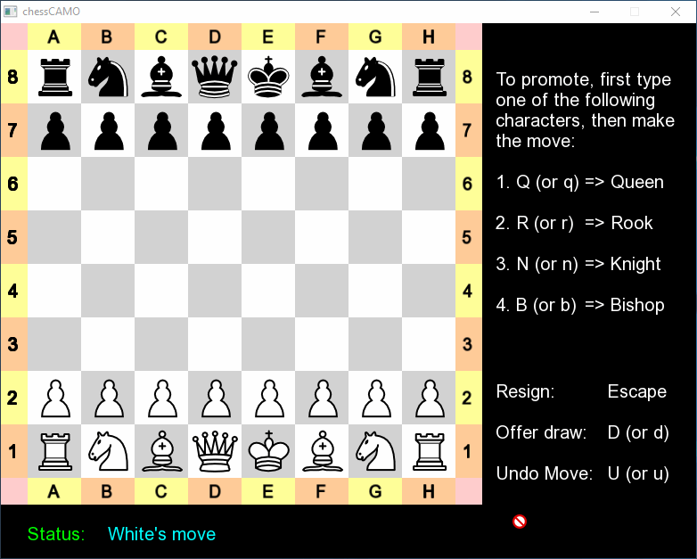
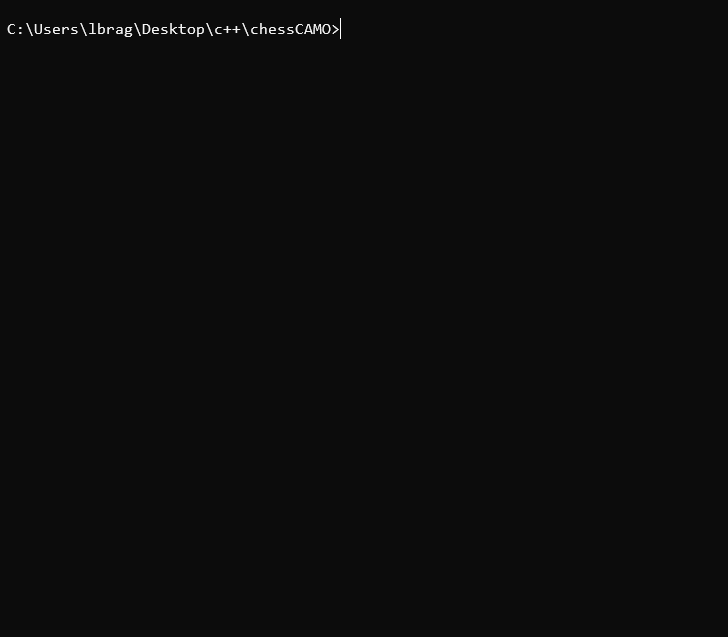
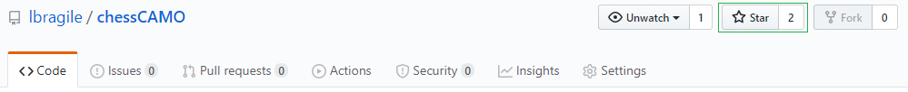
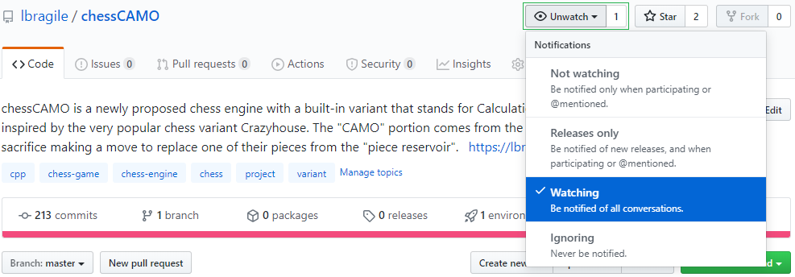

# chessCAMO :gem:

### :point_right: *Chess engine with a twist in the form of a new variant* :point_left:

## Project Description :pencil:

*chessCAMO* is a newly proposed chess engine with a built-in variant that stands for **C**alculations **A**lways **M**ake **O**pportunities and was inspired by the very popular chess variant <a href="https://en.wikipedia.org/wiki/Crazyhouse" target="__blank" style="text-decoration: none;">Crazyhouse</a>.

The "CAMO" portion comes from the idea that in this variant, at any turn, a player can sacrifice making a move to replace one of their pieces with a piece from the "piece reservoir". This has the affect of camouflaging each piece that is currently on the board. 

        

## Installation :arrow_down:

### Graphical User Interface (GUI) :clinking_glasses:

#### Compiler

- Can be used **without** any pre-requests besides the files found in this repository :smiley:

#### Clone

- `git clone https://github.com/lbragile/chessCAMO.git`

#### Run

- `cd chessCAMO/GUI/`
- `chessCAMO`

### Console (Windows) :+1:

#### Compiler

- A GCC/G++ <a href="https://www.ics.uci.edu/~pattis/common/handouts/mingweclipse/mingw.html" target="__blank" style="text-decoration: none;">compiler</a> is required!

#### Clone

- `git clone https://github.com/lbragile/chessCAMO.git`

#### Run

- `cd chessCAMO`
- `mingw32-make all_main`
- `main`

## Usage

### Graphical User Interface (GUI) 

For any board representation, the user can press one of the following keys on their keyboard for a respective action to occur.

#### <u>Regular Move</u>

- **Esc** - Resign (forfeit the game)
- **D** - Offer a draw
- **U** - Undo a move

#### <u>Prior to Promotion</u>

If you would like to have a specific promotion piece type, you must indicate so prior to making the move with the following keys. Otherwise, the default type *(Queen)* will be applied.

- **Q** - Queen
- **R** - Rook
- **B** - Bishop
- **N** - Knight

#### <u>Move & Side Highlighting</u>

The "Cyan" highlighted squares indicate the legal moves you can make for any board position. Similarly, the "Green" highlighted squares indicate the side whose turn it currently is for a more visual feel. Side movement is also displayed at the bottom, in the *status* field. 

- **1** - Toggle on/off *side* highlighting
- **Numpad 1** - Toggle on/off *move* highlighting

#### <u>Note</u>

The above keys are NOT case sensitive, thus pressing **U** (shift + u) is the same as simply pressing **u**.

### Console (Windows)

The console provides instructions after each move and is thus more transparent to the user. This means that the user must enter the required information at each step.

#### <u>Reservoir</u>

Unlike the GUI, where you can drag and drop a piece from the reservoir to the board, the Console requires you to input a special type of source square *character*, followed by the regular destination square. Follow the instructions in the console window to do this correctly. Remember that there is a fixed quantity of pieces in the reservoir (as indicated by the quantity numbers) and thus a move can fail if you do not have any more of that piece in the reservoir. 

For example, `Enter a source AND destination square in [A1, H8]: Q E2`, will place a *Queen* from the piece reservoir on `E2` and replace the existing piece, assuming it is that side's turn, and at the same time decrease the side's piece reservoir quantity count to `Queen x0`. Note that the destination square can also be `e2` or `52` for the same affect to occur.

## Variant's Rules :straight_ruler::notebook:

1. The piece reservoir is limited in size and cannot be re-stocked with pieces.
2. Once a player decides to use a piece from the reservoir to replace one of his existing pieces on the board, their turn is over.
3. An obvious rule is that player cannot use the reservoir while in check as they must make a move to avoid check.
4. Additionally, just like in the *Crazyhouse* variant, a player cannot directly promote a pawn from the reservoir. That is a pawn from the reservoir must be placed on the board first and is only allowed to be promoted on the next move.

## Documentation :raised_hands:

Check out the very detailed <a href="https://lbragile.github.io/chessCAMO/" target="__blank" style="text-decoration: none;">documentation file</a> to clear up any questions you might have.

### To Do :wink:

#### Regular Chess: :smirk:

- [x] Board representation undo ~~(use queue?)~~ - used serialization.
- [x] Input as PGN rather than two integers (using template).
- [x] GUI - ~~nice to be able to move pieces with mouse rather than inputting coordinates.~~ in progress (more details for user in the interface will be added).
- [ ] Three move repetition (draw) & 50 move rule.

#### ChessCAMO: :grin:

- [x] Make piece reservoir ~~(stack)~~ used `vector<pair<int, char>>` where `int` is the quantity and `char` is the piece type.
- [x] Allow players to replace existing pieces with reservoir pieces. 
- [x] Display reservoir piece quantity and ensure a player cannot use more pieces than there are in the reservoir.
- [x] Prevent reservoir piece from replacing identical piece type or king.
- [x] Implement abovementioned ~~check~~ check/double check and pawn promotion rules. Note that pawns cannot move 2 squares regardless of where they are placed, and they cannot be placed in the first rank for the respective players.

## Tests :heart_eyes: 

 

### Run

- `mingw32-make all_unit`

- `unit --gtest_color=yes` :arrow_right: colored output (Pass (GREEN)/Fail (RED)) 

  #### <b> OR </b>

- `mingw32-make all_unit`

- `unit` :arrow_right: regular output (no color) 

### Unit Testing :mag:

Currently chessCAMO utilizes the <a href="https://github.com/google/googletest" target="__blank" style="text-decoration: none;">GoogleTest</a> Framework to create test fixtures that cover as much of the implementation file as possible.

You can contribute to this project by making test cases that can challenge the chessCAMO engine in unique ways to ensure that it follows proper chess rules. To do so, please refer to the appropriate <a href="https://lbragile.github.io/chessCAMO/unit.html" target="__blank" style="text-decoration: none;">section</a> in the documentation file.

## Contributing :sparkling_heart: 

  

Please refer to the <a href="https://github.com/lbragile/chessCAMO/blob/master/CONTRIBUTING.md" target="__blank" style="text-decoration: none;">CONTRIBUTING.md</a> document.

## Like What You See? :thumbsup:

### Give Stars :star:

Make the maintainer happy by hitting the star icon for this repository!

### Add to Watch List :eyes:

Consider adding this repository to your watch list to stay updated on what new feature is implements.

## Inspiration​ :chart_with_upwards_trend:

I decided to create this project due to my growing interest in software development. Coming from an Engineering background with Deep Learning research experience (Recent Master of Applied Science graduate), I realized that writing and developing code (both front and back end) were highly
appealing to me. Thus, I spent a lot of time building upon my existing coding knowledge through online material and knew that it is time to test my knowledge on a challenging project. Additionally, I played chess (not very seriously) consistently since the age of about 4-5, so one can say that it is a very
big part of my life. As a result, this project allowed me to gain valuable experience and knowledge while working on a topic that I am passionate about and have expertise in.

## YouTube - Look Out :fire:

Be on the look out for a detailed YouTube video series explaining the various sections of this project. I feel like others could benefit from the logic involved in creating a project on this scale, which is relatively large and requires a substantial time commitment. Often times, when starting from scratch, an inexperienced software developer will quickly get overwhelmed by the complexity and decide to end the project before anything major is finished. I was in the same boat before and understand the frustration of wanting to work on an interesting project, but simply not being able to. It is often best to work on small pieces and build your way to the final product. This gives you a sense of accomplishment at each step and prevents you from experiencing the overwhelmed feeling. Let me know if you are interested in me making the videos and what you would like to see.

## Need Support? :ok_hand:

Reach out to me at any of the following:

- <a href="https://www.linkedin.com/in/liorbragilevsky/" target="__blank" style="text-decoration: none;">LinkedIn</a>
- <a href="https://www.facebook.com/lbragi/" target="__blank" style="text-decoration: none;">Facebook</a>
- lbragile.masc@gmail.com

## License :car:

- <a href="https://github.com/lbragile/chessCAMO/blob/master/LICENSE" target="__blank" style="text-decoration: none;"><b>MIT License</b></a> 

- C​o​p​y​ri​gh​t​ :copyright: 2020 Lior Bragilevsky

